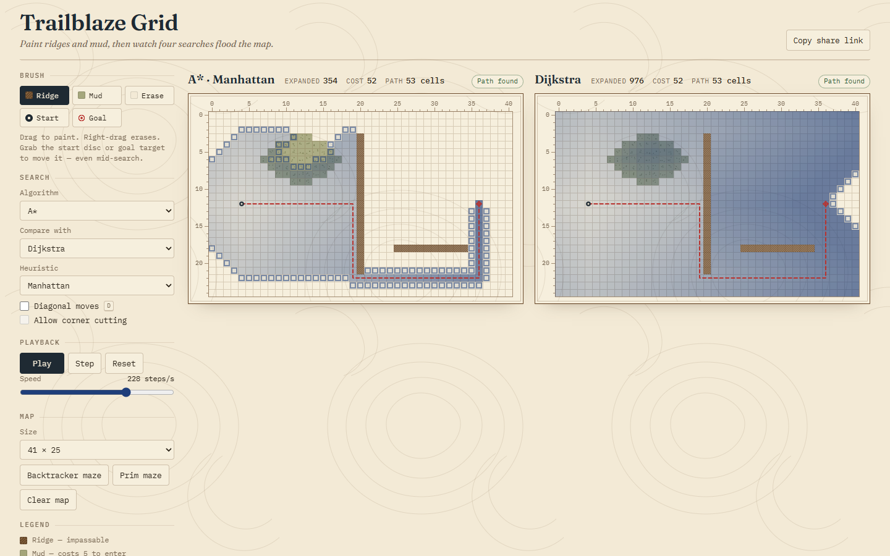

# Trailblaze Grid

Paint walls and mud on a canvas grid, then watch BFS, Dijkstra, Greedy, and A*
flood outward and trace their paths.



Drag the goal marker while A* is paused mid-search and the frontier re-blooms
instantly from the new target. Put Dijkstra in the second panel and you can
see it swell into a perfect circle while A* stays a narrow teardrop.

## Features

- **Canvas grid** up to 59 × 39 (the codec accepts any size up to 60 × 40;
  the presets are odd so mazes fill the whole lattice) with five brushes:
  ridge (wall), mud (cost 5), eraser, start, goal. Drag to paint; right-drag
  erases; grab a marker to move it at any time, including mid-search.
- **Four algorithms from scratch** — BFS, Dijkstra, Greedy best-first, and A*
  — driven by one search loop and one hand-rolled binary heap. A* and Greedy
  take Manhattan, Euclidean, or Chebyshev heuristics.
- **Animated layers** for frontier, visited (ink deepens with g-cost), and the
  final dashed survey line. Play / pause / single-step, exponential speed
  slider, live counts of expanded nodes, path cost, and path length.
- **Maze generators**: recursive backtracker (long corridors) and randomized
  Prim (bushy dead ends), seeded and deterministic.
- **Diagonal movement** toggle with a corner-cutting rule; diagonal steps cost
  √2 × the entered cell's weight.
- **Compare mode**: two algorithms run on the same grid in split view, each
  with its own counts.
- **Shareable URL**: the whole scene (grid at 2 bits per cell, markers,
  algorithm, heuristic, movement rules) lives in the URL hash and is restored
  on reload.
- Keyboard: `Space` play/pause · `.` step · `R` reset · `D` diagonals ·
  `1`–`5` brushes.

## How it works

All four algorithms are the same best-first loop. A frontier of `(cell, g, f)`
entries sits in a binary min-heap ordered by `f`; each iteration pops the
lowest-`f` entry, marks the cell closed, and relaxes its neighbours, pushing
any that got cheaper. The only thing that changes between algorithms is how `f`
is derived from the path cost `g`, the heuristic estimate `h`, and the insertion
sequence number `seq`:

```
BFS       f = seq        (FIFO — the heap degenerates into a queue)
Dijkstra  f = g
Greedy    f = h
A*        f = g + h
```

Ties on `f` prefer the deeper node (larger `g`), which keeps A* from wandering
sideways across plateaus of equal estimate. Stale heap entries left behind by
a later, cheaper relaxation are skipped when popped, so no decrease-key is
needed. BFS counts steps rather than terrain weight, which is why it can find
a *shorter* path that costs more than Dijkstra's.

The search is a generator: every expansion yields `{ cell, g, discovered }`
and the final `return` carries `{ path, cost, expanded }`. The UI knows nothing
about algorithms — it just calls `next()` at the rate the speed slider dictates.
Stepping, pausing, and comparing two searches are all just two generators being
advanced in lockstep. When you edit the map mid-run, the generator is rebuilt
and fast-forwarded to the same expansion count, so the frontier appears to
re-bloom around the new terrain or goal without a visible restart.

```
   g-cost from S          Dijkstra frontier      A* frontier (Manhattan)
   4 3 2 3 4 5            . . . . . . .          . . . . . . .
   3 2 1 2 3 4            . o o o o o .          . . . . . . .
   2 1 S 1 2 3            o o o S o o o          . . S o o o G
   3 2 1 2 3 4            . o o o o o .          . . . . . . .
   4 3 2 3 4 5            . . . . . . .          . . . . . . .
```

Rendering uses three stacked canvases per map plate. Terrain (hatched ridges,
stippled mud, coordinate margins) and the ink layer (frontier outlines, visited
tint) each keep a set of dirty cell indices and repaint only those on the next
frame; the marks layer (path, start, goal) is tiny and redrawn whole. This is
what keeps a 59 × 39 grid smooth at 1,700 expansions per second.

## Run

```sh
npm install
npm run dev        # Vite dev server
npm run build      # tsc + vite build → dist/
npm test           # vitest run
```

## Tests

`tests/` covers the heap under a randomised workload, each algorithm's path
length and cost on hand-built grids, heuristic values, the enclosed-goal case
(A* must return `null` after expanding exactly the reachable set), A* doing no
more work than Dijkstra on a seeded maze while matching its cost, diagonal
costs and the corner-cutting rule, maze connectivity for both generators, and
scene encode/decode round-trips including malformed input.

## Tech

Vite 8 · TypeScript 6 · Vitest 5 · Canvas 2D · hand-written CSS with custom
properties · Fraunces and IBM Plex Mono via `@fontsource`. No runtime
dependencies beyond the fonts.

## License

MIT © 2026 Jafn
